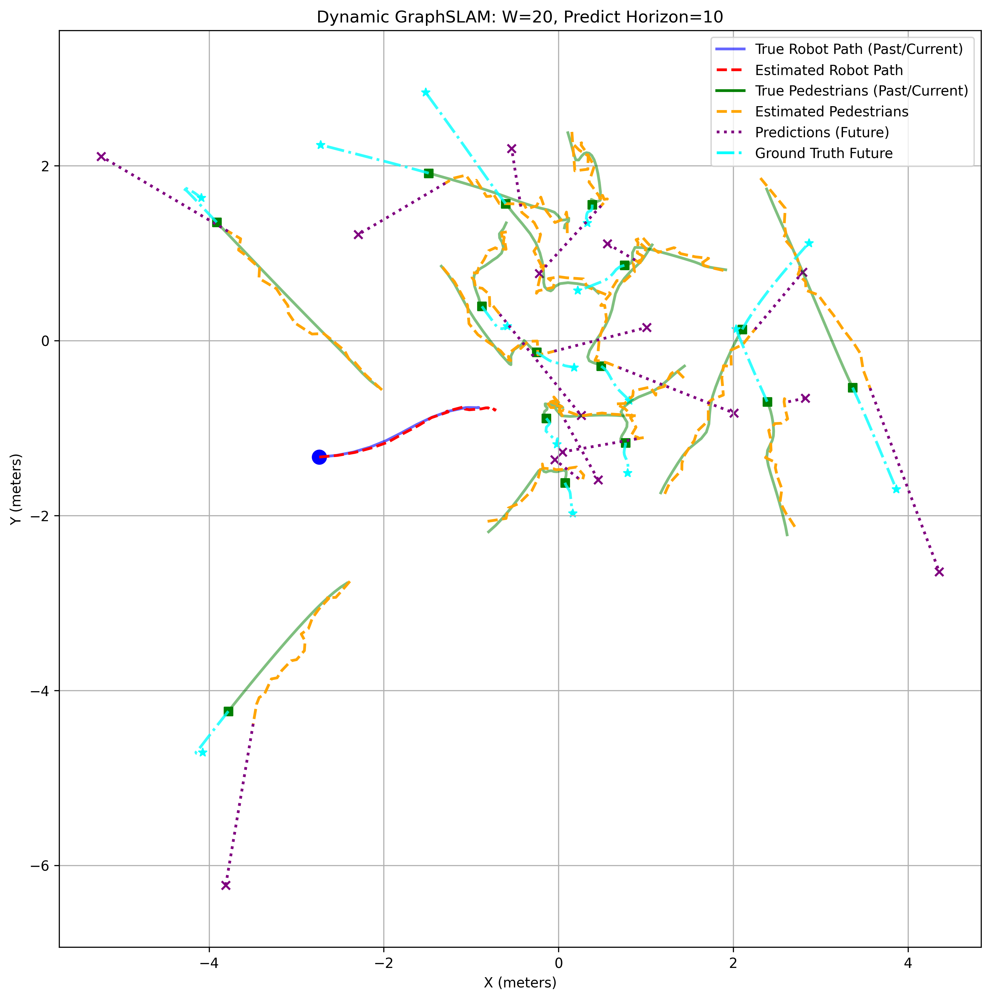
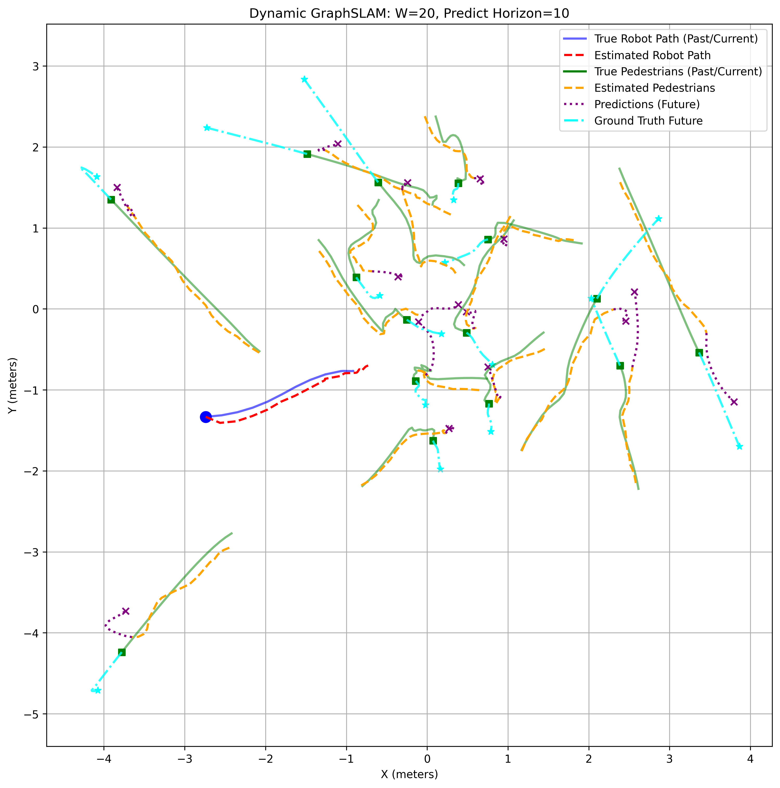

# DynoSLAM: Dynamic SLAM with Generative Graph Neural Networks for Real-World Social Navigation


<br>

> **DynoSLAM** is a tightly-coupled Dynamic GraphSLAM architecture that integrates socially-aware Graph Neural Networks (GNNs) directly into the factor graph optimization. Unlike conventional approaches that use rigid constant-velocity heuristics or deterministic single-agent neural priors, our framework formulates pedestrian motion forecasting as a stochastic **World Model**. By utilizing Monte Carlo rollouts from a trained GNN, we capture the multimodal epistemic uncertainty of human interactions and embed it into the SLAM graph via a dynamic **Mahalanobis distance factor**. We demonstrate through extensive simulated experiments that this stochastic formulation not only maintains highly accurate retrospective tracking (Robot RMSE of **0.39m**) but also prevents the optimization failures caused by the deterministic "argmax problem". Ultimately, extracting the empirical mean and covariance matrices of future pedestrian states provides a mathematically rigorous, probabilistic safety envelope for downstream local planners (e.g., MPC or PPO), enabling anticipatory and collision-free robot navigation in densely crowded environments.

## Method Overview

Conventional dynamic SLAM systems either mask out moving objects or track them using naive linear physics (e.g., Constant Velocity). **DynoSLAM** introduces a paradigm shift by augmenting the GraphSLAM factor graph with data-driven, socially-aware motion priors. 

1. **Stochastic World Model**: We employ a Graph Attention Network (GAT) to process the spatial history of pedestrians. Instead of outputting a single deterministic path, we query the GAT using Monte Carlo perturbations to generate multiple socially-aware future rollouts, capturing the inherent ambiguity of human interactions.
2. **Dynamic Mahalanobis Factor**: We compute the empirical mean and covariance of these rollouts. This covariance is embedded directly into the SLAM objective function as a dynamic Mahalanobis distance factor. 
3. **Adaptive Optimization**: The kinematic prior automatically adjusts its stiffness — tightly binding the graph in open spaces and relaxing during complex, unpredictable human interactions. The resulting covariance ellipses can be seamlessly streamed to an MPC/PPO controller for safe avoidance.


## Main Results

Our experiments demonstrate that traditional linear models (like the Constant Velocity Model) fail to anticipate the non-linear avoidance maneuvers of pedestrians, blindly predicting straight-line collisions. Deterministic neural networks suffer from the "argmax problem" and produce jittery outputs. 

**Stochastic GAT (Ours)** successfully averages multiple Monte Carlo rollouts, yielding smooth, curved predictions that align with the true future while explicitly capturing epistemic uncertainty.

<p align="center">
  
  &nbsp; &nbsp;
  
</p>
<p align="center">
  <em><b>Left:</b> Constant Velocity Model (CVM) strictly follows a straight line, missing the avoidance maneuver. <br>
  <b>Right:</b> Stochastic GAT (Ours) produces a smooth, socially-aware prediction by averaging multiple rollouts.</em>
</p>

## Simulator

To train and evaluate our algorithms in highly interactive pedestrian environments, we use a custom 2D social navigation simulator based on [**PyMiniSim**](https://github.com/TimeEscaper/pyminisim/tree/master?tab=readme-ov-file). The pedestrians in this environment are governed by the [Headed Social Force Model (HSFM)](https://github.com/francescofarina/HeadedSocialForceModel?tab=readme-ov-file), generating complex, non-linear avoidance trajectories.

### Installation:
```
cd pyminisim
pip install -e .
```

```
git clone https://github.com/sybrenstuvel/Python-RVO2.git
cd Python-RVo2
pip install -r requirements.txt
python setup.py build
python setup.py install
```

### Generating trajectories
For visualization of generated trajectory, run:

```
python -m examples.data_generator --mode visual --ped_count 10 20 --speed_range 1.0 1.6
```

to generate trajectories:
```
python -m examples.data_generator --mode dataset --num_episodes 10000 --ped_count 5 20 --speed_range 0.8 1.5 --tau_range 0.2 0.6 --output all_data.csv
```

## Getting Started (SLAM Pipeline)

### 1. Installation
If you haven't already, install the main project dependencies:
```bash
pip install -r requirements.txt
```

### 2. Training the Prior Models
To train the neural velocity predictors (MLP or GAT) on the simulated pedestrian dataset:
```bash
python train.py
```
*The best weights will be automatically saved to the `weights/` directory (e.g., `gat_best.pth`).*

### 3. Evaluation & Inference
To run the full DynoSLAM pipeline on a single episode and visualize the graph optimization and prediction horizons:
```bash
python main_eval_gat.py
```

To run a massive parallel evaluation across the entire dataset and calculate global metrics (RMSE, ATE, SDE):
```bash
python main_eval_gat_parallel.py
```
*This will generate a detailed CSV file (e.g., `gat_stochastic_metrics_horizon20.csv`) with the results for all episodes.*

## Authors

- [**Danil Tokhchukov**](https://github.com/makriot) (Skoltech, Moscow, Russia)  
- [**Veronika Morozova**](https://github.com/NikaMorozova) (Skoltech, Moscow, Russia)
